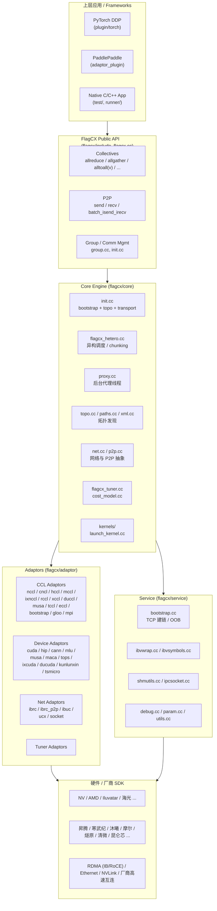
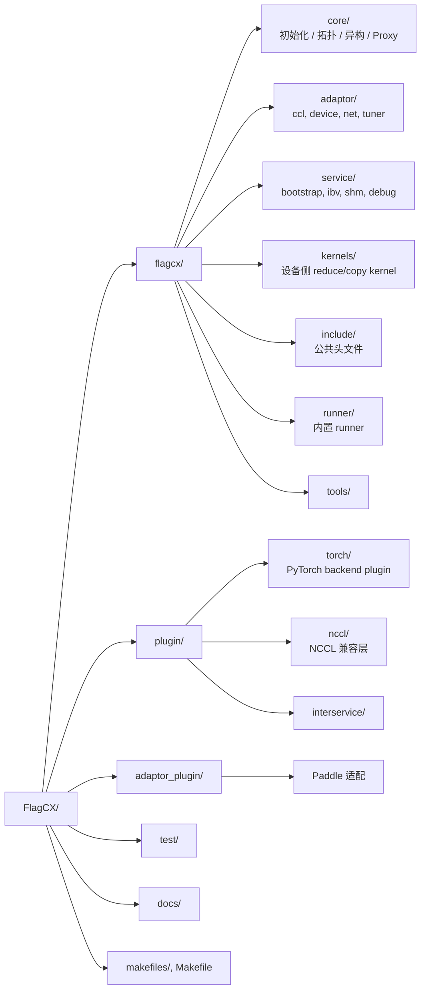
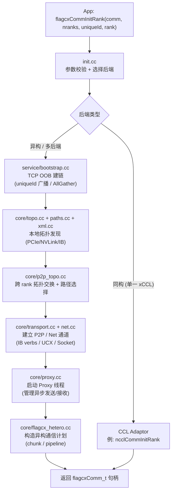
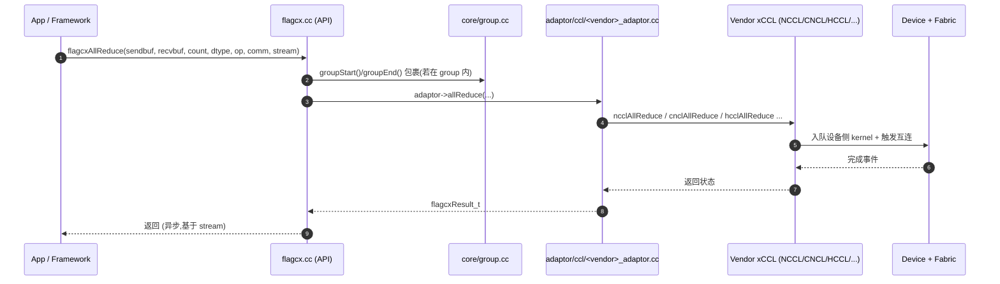
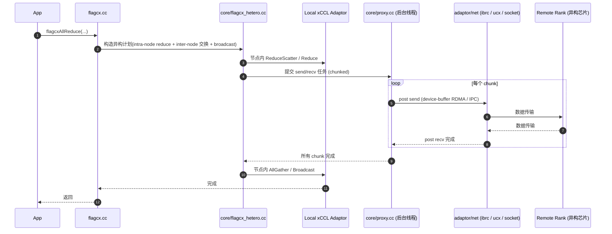
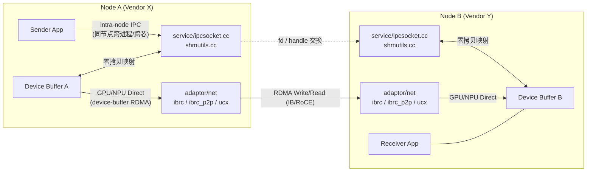
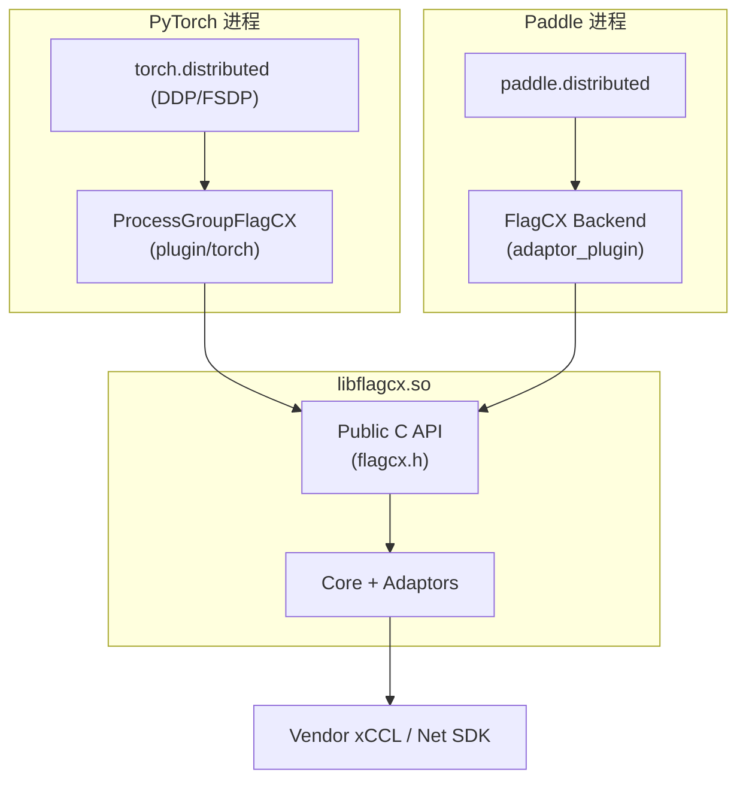

# FlagCX 架构与流程图 / Architecture & Flow Diagrams

本文用 [Mermaid](https://mermaid.js.org/) 图把 FlagCX 的整体架构与典型执行流程落地到仓库,
方便新贡献者快速建立"代码地图"。所有图都基于仓库现状(`flagcx/core`、`flagcx/adaptor`、
`flagcx/service`、`plugin/`)绘制。

> GitHub 已原生支持在 Markdown 中渲染 Mermaid 代码块,无需额外工具即可查看。

## 目录

- [1. 总体分层架构](#1-总体分层架构)
- [2. 模块/目录映射](#2-模块目录映射)
- [3. Communicator 初始化流程](#3-communicator-初始化流程)
- [4. 同构 AllReduce 调用路径](#4-同构-allreduce-调用路径)
- [5. 异构集合通信(Hetero Proxy)时序](#5-异构集合通信hetero-proxy时序)
- [6. Device-Buffer IPC / RDMA 数据通路](#6-device-buffer-ipc--rdma-数据通路)
- [7. 框架接入(PyTorch / Paddle Plugin)](#7-框架接入pytorch--paddle-plugin)

---

## 1. 总体分层架构

要点:

- **API 层**(`flagcx/flagcx.cc` + `flagcx/include`)对外暴露统一的 C 接口,语义对齐 NCCL。
- **Core 层**负责 communicator 生命周期、拓扑发现、异构调度、Proxy 后台线程、kernel 启动。
- **Service 层**提供 bootstrap、IB verbs 加载、共享内存/IPC socket、日志参数等基础设施。
- **Adaptor 层**通过 plugin 加载机制(`*_plugin_load.cc`)在运行时绑定到具体的 CCL / Device / Net 后端,实现"一次开发,跨芯运行"。

---

## 2. 模块/目录映射

---

## 3. Communicator 初始化流程

下图给出 `flagcxCommInitRank` 类调用从应用进入 Core 的关键步骤
(对应 `flagcx/core/init.cc`、`bootstrap.cc`、`topo.cc`、`transport.cc`、`proxy.cc`)。

---

## 4. 同构 AllReduce 调用路径

> 同构路径下,FlagCX 主要承担"统一 API + 适配分发"的角色,实际数据搬运由原生 xCCL 完成。

---

## 5. 异构集合通信(Hetero Proxy)时序

异构场景下,跨厂商芯片之间没有统一的 xCCL,FlagCX 用 **Proxy 线程 + Net Adaptor** 在
host 侧编排数据搬运,并把"同侧"部分下沉给本地 xCCL。

---

## 6. Device-Buffer IPC / RDMA 数据通路

FlagCX 的两项原创能力(见 `README.md` About 一节):**device-buffer IPC** 与
**device-buffer RDMA**。它们在异构 P2P 场景下绕过多余的 H2D/D2H 拷贝。

要点:

- **IPC 路径**:同节点通过 `ipcsocket` 交换 device handle / fd,使对端进程直接映射本地 device buffer。
- **RDMA 路径**:跨节点通过 IB verbs(`service/ibvwrap.cc` + `adaptor/net/ibrc*`)发起 device-direct RDMA,避免在 host 上中转。
- 上层调度由 `core/proxy.cc` 负责,根据拓扑(`paths.cc`)选择最优通道。

---

## 7. 框架接入(PyTorch / Paddle Plugin)

要点:

- PyTorch 集成走 `plugin/torch`,实现 `c10d::Backend`,把 `all_reduce / all_gather / send / recv` 等调用转换为 FlagCX C API。
- Paddle 集成位于 `adaptor_plugin/`。
- 两者最终落到 `libflagcx.so` 的统一 API,由 Core + Adaptor 选择具体后端。

---

## 维护说明

- 本文档的图基于仓库当前目录结构绘制;若 `flagcx/core`、`flagcx/adaptor`、`flagcx/service`
  或 `plugin/` 下新增/重命名了重要模块,请同步更新对应 Mermaid 块。
- 如需导出图片,可使用 [mermaid-cli](https://github.com/mermaid-js/mermaid-cli)
  (`mmdc -i architecture.md -o architecture.png`),建议把图片放到 `docs/images/` 下,并在本文中引用。
