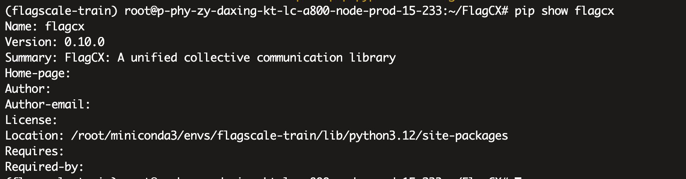

## Build and Installation

### Obtain Source Code

```
git clone https://github.com/flagos-ai/SDCCL.git
cd SDCCL
git submodule update --init --recursive
```

### Installation

**Option A — Pythonic Installation (pip install):**

```shell
pip install . -v --no-build-isolation
```



**Option B — C++ library (make):**

```shell
make <backend>=1 -j$(nproc)
```
where `<backend>` is one of:
- `USE_NVIDIA`: NVIDIA GPU support
- `USE_ILUVATAR_COREX`: Iluvatar Corex support
- `USE_CAMBRICON`: Cambricon support
- `USE_METAX`: MetaX support
- `USE_MUSA`: Moore Threads support
- `USE_KUNLUNXIN`: Kunlunxin support
- `USE_DU`: Hygon support
- `USE_ASCEND`: Huawei Ascend support
- `USE_AMD`: AMD support
- `USE_TSM`: TsingMicro support
- `USE_ENFLAME`: Enflame support
- `USE_GLOO`: GLOO support
- `USE_MPI`: MPI support

Note that Option A also supports `<backend>=1`, allowing users to explicitly specify the backend. Otherwise, it will be selected automatically.

## Tests

### Performance Test

Performance tests are maintained in `test/perf`.

```shell
cd test/perf
make [USE_NVIDIA | USE_ILUVATAR_COREX | USE_CAMBRICON | USE_METAX | USE_MUSA | USE_KUNLUNXIN | USE_DU | USE_ASCEND | USE_TSM | USE_ENFLAME]=1
mpirun --allow-run-as-root -np 8 ./test_allreduce -b 128K -e 4G -f 2
```

Note that the default MPI install path is set to `/usr/local/mpi`, you may specify the MPI path with:

```shell
make MPI_HOME=<MPI path>
```

All tests support the same set of arguments:

- Sizes to scan

  * `-b <min>` minimum size in bytes to start with. Default: 1M.
  * `-e <max>` maximum size in bytes to end at. Default: 1G.
  * `-f <increment factor>` multiplication factor between sizes. Default: 2.

- Performance

  * `-w, <warmup iterations >` number of warmup iterations (not timed). Default: 5.
  * `-n, <iterations >` number of iterations. Default: 20.

- Test operation

  * `-R, <0/1/2>` enable local buffer registration on send/recv buffers. Default: 0.
  * `-s, <OCT/DEC/HEX>` specify MPI communication split mode. Default: 0

- Utils

  * `-p, <0/1>` print buffer info. Default: 0.
  * `-h` print help message. Default: disabled.

### Device API Test

Device API tests are maintained in `test/kernel/`. There are four test binaries:

| Binary | What it tests |
|---|---|
| `test_intranode` | Intra-node AllReduce via Device API. Correctness + bandwidth benchmarking. |
| `test_internode_twosided` | Inter-node two-sided AlltoAll (FIFO-based; Window-based with `-R 2`). Correctness + bandwidth. |
| `test_internode_onesided` | Inter-node one-sided AlltoAll (put+signal+wait pattern). Requires `-R 1` or `-R 2`. |
| `test_device_api` | Correctness suite for 10 one-sided Device API kernels. Requires `-R 1` or `-R 2`. |

Build:

```shell
cd test/kernel
make USE_NVIDIA=1    # or other backend flag
```

Supports `MPI_HOME=<path>`.

Run examples:

```shell
# Intra-node AllReduce (single node, 8 GPUs)
mpirun --allow-run-as-root -np 8 -x SDCCL_USE_HETERO_COMM=1 -x SDCCL_MEM_ENABLE=1 ./test_intranode -b 1M -e 64M -f 2

# Inter-node two-sided AlltoAll (multi-node)
mpirun --allow-run-as-root -np 16 -x SDCCL_USE_HETERO_COMM=1 -x SDCCL_MEM_ENABLE=1 ./test_internode_twosided -b 1M -e 64M -f 2 -R 1

# Inter-node one-sided AlltoAll (requires -R 1 or -R 2)
mpirun --allow-run-as-root -np 16 -x SDCCL_USE_HETERO_COMM=1 -x SDCCL_MEM_ENABLE=1 ./test_internode_onesided -b 1M -e 64M -f 2 -R 2

# Device API correctness test (requires -R 1 or -R 2)
mpirun --allow-run-as-root -np 16 -x SDCCL_USE_HETERO_COMM=1 -x SDCCL_MEM_ENABLE=1 ./test_device_api -b 1M -e 64M -f 2 -R 2
```

Arguments are the same as Performance Test (`-b`, `-e`, `-f`, `-w`, `-n`, `-R`, `-p`, `-s`).

Registration modes (`-R`):

- `-R 0`: Raw device memory (default). No explicit registration.
- `-R 1`: IPC mode — `sdcclMemAlloc` + `sdcclCommRegister`.
- `-R 2`: Window mode — `sdcclMemAlloc` + `sdcclCommWindowRegister`.

One-sided tests (`test_internode_onesided`, `test_device_api`) require `-R 1` or `-R 2`.
